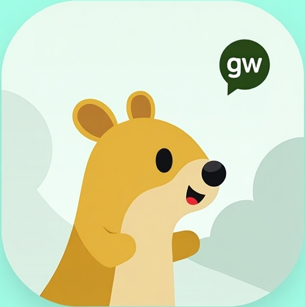

# GW_CHAT

## Технологии

- Golang
- WebSockets
- PostgreSQL
- Redis
- Docker
- Docker Compose

## Функционал

Чат-приложение для отправки сообщений в реальном времени.
С функционалом:
- Регистрации/Входа
- Личный кабинет с возможностью смены пароля и общей информацией о пользователе
- Личная переписка с отдельным пользователем
- Групповая переписка

