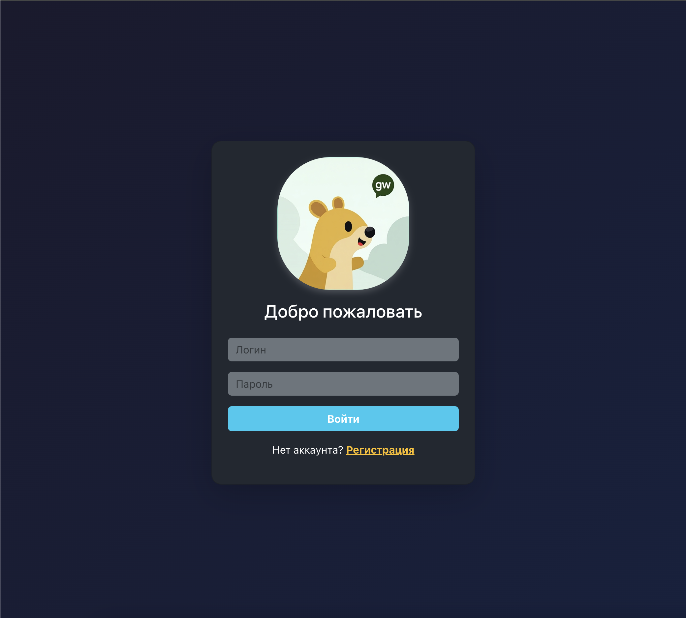
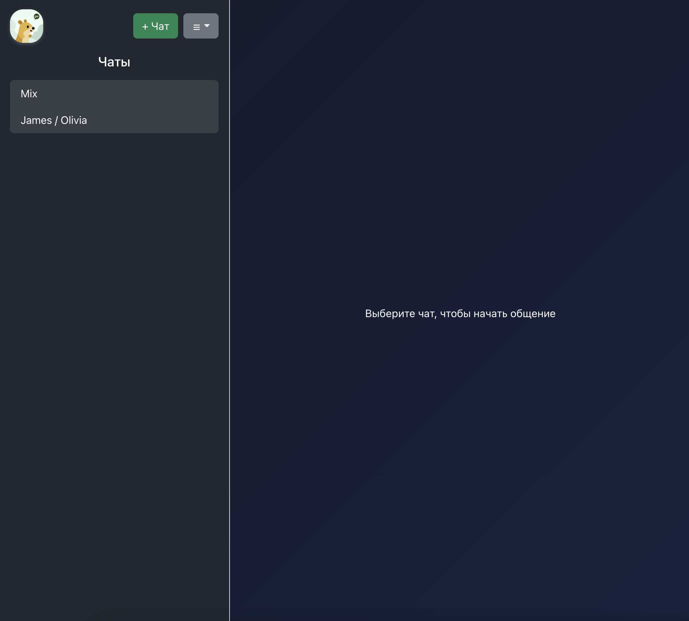
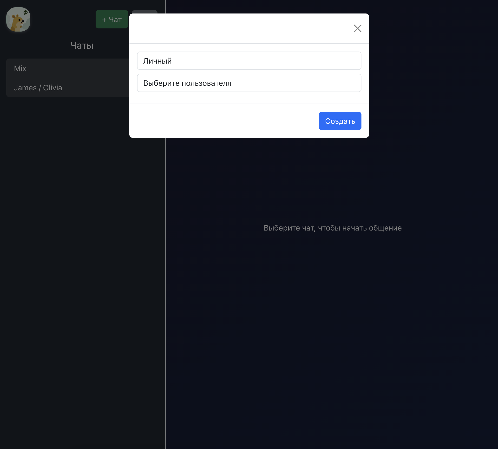
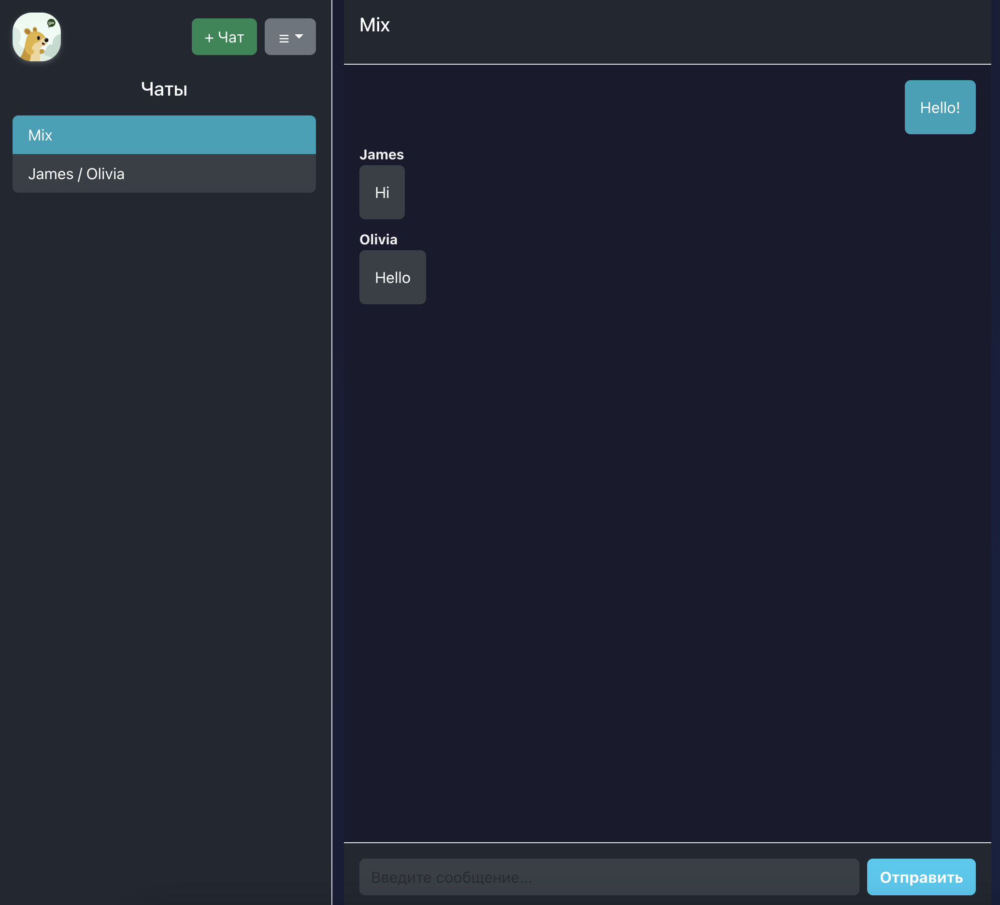
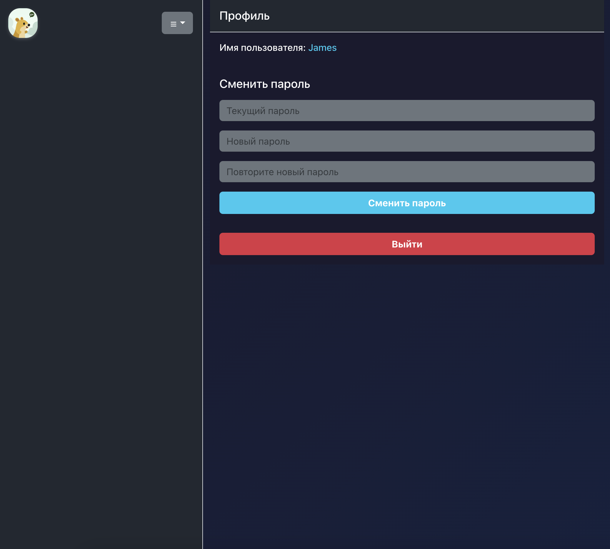

# GW CHAT

## Описание функционала

Чат-приложение для отправки сообщений в реальном времени.
С функционалом:
- Регистрации/Входа
- Личный кабинет с возможностью смены пароля и общей информацией о пользователе
- Личная переписка с отдельным пользователем
- Групповая переписка

## Технологии

- Golang
- WebSockets
- PostgreSQL
- Docker
- Docker Compose

## Развертывание
Развертывание сервиса должно осуществляться с использованием docker compose в директории с проектом.
- `cp .env.example .env` - копирование файла .env.example в .env
- `docker-compose up -d` - запуск сервиса
- `docker cp db/schema.sql <container_name>:/path/in/container/schema.sql` - копирование скрипта создания базы данных в контейнер
- `docker exec -i <container_name> psql -U <username> -d <database_name> -f /path/in/container/schema.sql` - выполнение скрипта создания базы данных в контейнере

## Экраны приложения

  

    
  

  

    
  

    
  

    
  

  

    
  

